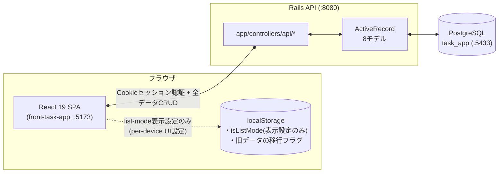
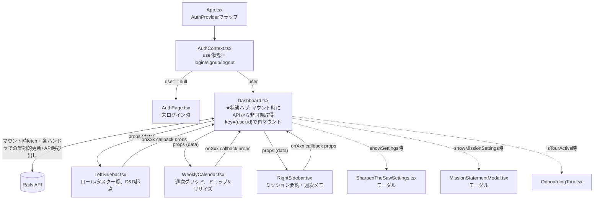
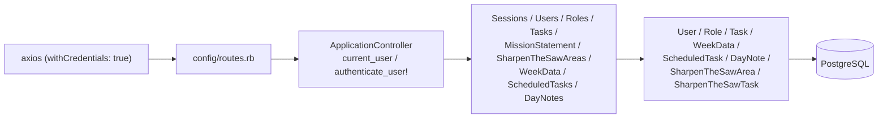
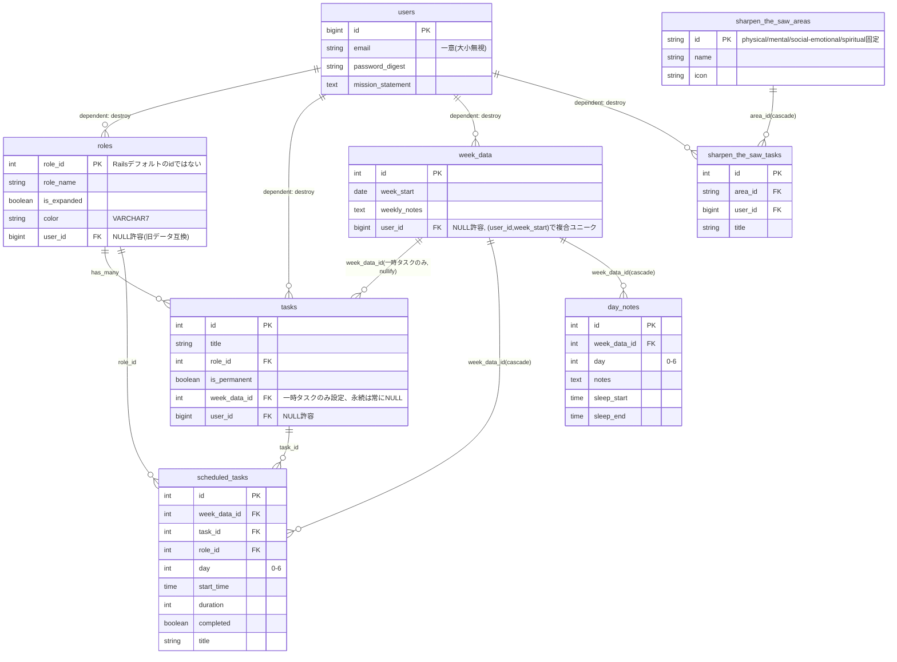
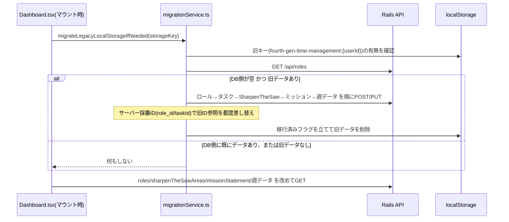
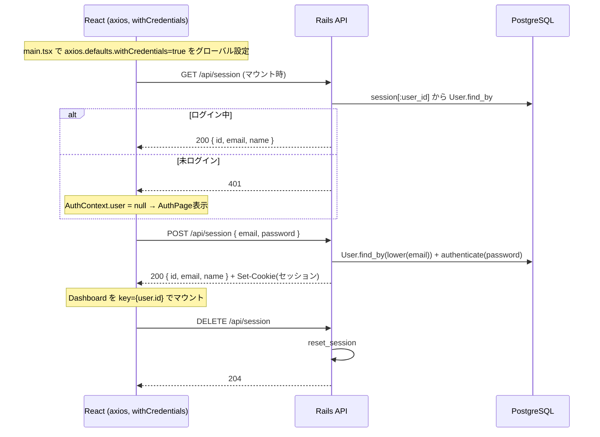

# ARCHITECTURE — WeeklyCompass 構成マップ

> バイブコーディングで積み上がった実装を俯瞰するための現状スナップショット。
> 詳細な開発ルール・規約は [CLAUDE.md](CLAUDE.md) を参照。ここでは「何が・どこにあり・どう繋がっているか」を中心にまとめる。
>
> 2026-09-11: 全データをDBへ永続化する変更を反映（旧localStorage一本化構成からの移行）。

---

## 1. 全体像（今の実態）

**現在の実態**: ロール・タスク・週次スケジュール・日次/週次メモ・Sharpen the Saw・ミッションステートメントを含む**全データがPostgreSQLに永続化**されている。`localStorage`に残っているのはリスト表示モードのON/OFFという端末ローカルな表示設定と、旧バージョンからの移行が完了したかどうかのフラグのみ。

---

## 2. 技術スタック

| レイヤー | 技術 |
|---|---|
| フロントエンド | React 19 + TypeScript + Vite（ポート5173） |
| 状態管理 | React hooks のみ（Redux/Zustand等は不使用）。`Dashboard.tsx` が唯一の状態ハブ、初期データはAPIから非同期取得 |
| 永続化 | PostgreSQL（Rails API経由）。`localStorage`は表示設定(`isListMode`)と移行フラグのみ |
| スタイリング | CSS Modules（`*.module.css`）+ `src/index.css`（グローバル） |
| ドラッグ&ドロップ | `sortablejs`（ロール/タスク並び替え）+ ネイティブHTML5 DnD（カレンダーへのスケジューリング） |
| PDF出力 | `html2canvas` + `jspdf`（動的import、ボタン押下時のみ読み込み） |
| バックエンド | Ruby on Rails 8.1（APIモード）/ Ruby 3.3 |
| DB | PostgreSQL（DB名 `task_app`、ホスト側ポート5433） |
| 認証 | `has_secure_password`（bcrypt）+ Rails Cookieセッション |
| CORS | `rack-cors`（`credentials: true`） |
| テスト | Rails標準テスト（`bin/rails test`）、`task_app_test` DBでトランザクショナルテスト |

---

## 3. フロントエンド：コンポーネント構成とデータの流れ

- **単方向データフロー**: 子コンポーネントは直接stateを変更せず、`onXxx`コールバックprops（Vueのemitに相当）を呼ぶだけ。更新ロジックは全て`Dashboard.tsx`内のハンドラ関数に集約。
- **楽観的更新パターン**: 各ハンドラは「①ローカルstateを即時更新（体感速度維持）→②対応するAPIを呼ぶ」の順で動く。作成系（`addRole`/`addTask`/カレンダーへのドロップ等）はサーバー採番前の仮ID（`temp-${Date.now()}`）で先に描画し、レスポンスが返り次第、本物のIDへ差し替える。API失敗時は`console.error` + 画面上部の`saveError`バナーで通知する。
- **デバウンス**: `WeeklyCalendar`のリサイズ/ドラッグ（mousemoveのたびに発火）や日次/週次メモのキー入力は、[`utils/debounce.ts`](front-task-app/src/utils/debounce.ts)の`KeyedDebouncer`でサーバー保存だけ400〜600ms間引く。ローカル表示は即時反映されたまま。週切り替え・ログアウト時は保留中の書き込みを`flushAll()`で確定させてから遷移する。
- **初回ログイン時の自動移行**: マウント時、DBの`roles`が空かつブラウザに旧バージョンのlocalStorageデータが残っている場合のみ、[`migrationService.ts`](front-task-app/src/services/migrationService.ts)がロール→タスク→Sharpen the Saw→ミッションステートメント→週データの順にAPI経由でDBへ一括インポートし、完了後にlocalStorageを削除する（詳細は5節）。

### 主要ファイルの役割

| ファイル | 役割 |
|---|---|
| [App.tsx](front-task-app/src/App.tsx) | `AuthProvider`配下で`user`の有無により`AuthPage`/`Dashboard`を出し分け |
| [AuthContext.tsx](front-task-app/src/contexts/AuthContext.tsx) | マウント時に`GET /api/session`で認証状態確認 |
| [authService.ts](front-task-app/src/services/authService.ts) | `/api/session` `/api/users`クライアント |
| [apiBase.ts](front-task-app/src/services/apiBase.ts) | バックエンドオリジン`API_ORIGIN`（`VITE_API_BASE_URL`で上書き、未設定時`http://localhost:8080`） |
| [roleService.ts](front-task-app/src/services/roleService.ts) | `/api/roles`系クライアント（CRUD・reorder・isExpanded/color更新） |
| [taskService.ts](front-task-app/src/services/taskService.ts) | `/api/tasks`系クライアント（CRUD・reorder） |
| [weekDataService.ts](front-task-app/src/services/weekDataService.ts) | `/api/week_data`系クライアント（週データ本体・scheduled_tasks・day_notes） |
| [sharpenTheSawService.ts](front-task-app/src/services/sharpenTheSawService.ts) | `/api/sharpen_the_saw_areas`クライアント |
| [missionStatementService.ts](front-task-app/src/services/missionStatementService.ts) | `/api/mission_statement`クライアント |
| [migrationService.ts](front-task-app/src/services/migrationService.ts) | 旧localStorageデータの一回限りのDB移行処理 |
| [debounce.ts](front-task-app/src/utils/debounce.ts) | 高頻度更新をキーごとにまとめて間引く`KeyedDebouncer` |
| [Dashboard.tsx](front-task-app/src/components/Dashboard.tsx) | 状態ハブ。マウント時に各サービスから並行fetchし、`roles`/`sharpenTheSawAreas`/`missionStatement`/`weekDataCache`（訪問した週だけをキャッシュする`Map`）を保持 |
| [LeftSidebar.tsx](front-task-app/src/components/LeftSidebar.tsx) | ロール・タスク一覧表示、SortableJSでのD&D起点、アカウント情報バー |
| [WeeklyCalendar.tsx](front-task-app/src/components/WeeklyCalendar.tsx) | 週次グリッド。ドロップ受付・タスクのリサイズ・PDF出力ボタン |
| [RightSidebar.tsx](front-task-app/src/components/RightSidebar.tsx) | ミッションステートメント要約表示・週次メモ編集 |
| [SharpenTheSawSettings.tsx](front-task-app/src/components/SharpenTheSawSettings.tsx) | モーダル。4領域のタスク設定（保存時に全領域まとめて送信） |
| [MissionStatementModal.tsx](front-task-app/src/components/MissionStatementModal.tsx) | モーダル。ミッションステートメント編集 |
| [types/index.ts](front-task-app/src/types/index.ts) | `Role`/`Task`/`ScheduledTask`/`SharpenTheSawArea`/`DayNotes`/`WeekData`/`User`の型定義。IDは全て`string`（サーバーの数値IDは受信時に`String()`変換） |

---

## 4. バックエンド：リクエストの流れ

- `ApplicationController#current_user`が`session[:user_id]`から`User`を引く。`authenticate_user!`が全コントローラの`before_action`で必須、未ログインは401。
- 全エンドポイントが`current_user`経由でスコープされ、他ユーザーのデータを指定すると404（`scheduled_tasks`/`day_notes`は`week_data.user_id`経由でスコープ）。
- JSONキーはcamelCase（`roleId`/`isPermanent`/`weekStart`など）。新エンドポイント（week_data系・sharpen_the_saw_areas）は素直にフロントのTask/ScheduledTask型と一致する形（`id`キー）で返し、既存のroles/tasksエンドポイントは元の`taskId`キーのまま据え置いている（呼び出し側のサービス層でそれぞれ吸収）。

### 実装済みAPI一覧

| Method | Path | 内容 |
|---|---|---|
| POST | `/api/users` | サインアップ（成功時ログイン状態） |
| GET/POST/DELETE | `/api/session` | セッション確認・ログイン・ログアウト |
| GET/POST/PUT/DELETE | `/api/roles`, `PUT /api/roles/reorder` | ロールCRUD。`tasks`は永続タスクのみネスト。`update`はroleName/isExpanded/colorの部分更新に対応 |
| GET/POST/PUT/DELETE | `/api/tasks`, `PUT /api/tasks/reorder` | タスクCRUD。一時タスク(`isPermanent:false`)の作成・永続化解除には`weekStart`が必要（該当週の`week_data`に`week_data_id`で紐づける） |
| GET/PUT | `/api/mission_statement` | `users.mission_statement`の読み書き |
| GET/PUT | `/api/sharpen_the_saw_areas` | 4領域＋タスク一覧の取得、および全領域まとめての一括保存（差分diffで作成/更新/削除） |
| GET/PUT | `/api/week_data/:week_start` | その週の`week_data`（無ければ自動作成）＋`scheduledTasks`/`dayNotes`/`temporaryTasks`を返す。PUTは`weeklyNotes`のみ更新 |
| POST | `/api/week_data/:week_start/scheduled_tasks` | スケジュール済みタスク作成 |
| PUT/DELETE | `/api/scheduled_tasks/:id` | 部分更新（day/startTime/duration/title/completed）・削除 |
| PUT | `/api/week_data/:week_start/day_notes/:day` | 日次メモ・睡眠時間のupsert（`updateDayNotes`/`updateSleepTime`両方をこの1本でカバー） |

### 主なモデル

| ファイル | 内容 |
|---|---|
| [User](task-app/app/models/user.rb) | `has_secure_password`。`roles`/`tasks`/`sharpen_the_saw_tasks`/`week_data`を`dependent: :destroy`で保有 |
| [Role](task-app/app/models/role.rb) | 主キーは`role_id`。`tasks`を`sort_order, id`順で保有 |
| [Task](task-app/app/models/task.rb) | `role`と`user`に属する。`week_data`（`optional: true`）— 永続タスクは常に`nil`、一時タスクだけ対象週に紐づく |
| [WeekData](task-app/app/models/week_data.rb) | `scheduled_tasks`/`day_notes`/`temporary_tasks`（`is_permanent:false`のtasksへのスコープ）を保有 |
| [ScheduledTask](task-app/app/models/scheduled_task.rb) | `week_data`/`task`/`role`に属する |
| [DayNote](task-app/app/models/day_note.rb) | テーブル名`day_notes`（単数形クラス名`DayNote`がRails標準）。`week_data`に属する |
| [SharpenTheSawArea](task-app/app/models/sharpen_the_saw_area.rb) / [SharpenTheSawTask](task-app/app/models/sharpen_the_saw_task.rb) | 領域マスタ（4件固定、全ユーザー共通）とユーザーごとのタスク |

---

## 5. DBスキーマ（現在）

### 設計上の要点

- **一時タスクの週スコープ**: `tasks.week_data_id`（nullable）で、永続タスクは常に`NULL`、一時タスクだけその週の`week_data`に紐づく。`RolesController#role_json`は`role.tasks`を`is_permanent`でフィルタして永続タスクのみ返し、一時タスクは`WeekDataController`の`temporaryTasks`から取得する。
- **Sharpen the Sawのユーザー分離**: `sharpen_the_saw_tasks.user_id`を追加済み（旧実装はこの列が無く全ユーザー共有になるバグがあった）。`sharpen_the_saw_areas`（4領域のラベル自体）はアプリ共通マスタでユーザー編集不可。
- **マスタデータのid/name/icon**: `physical`/`mental`/`social-emotional`/`spiritual`（名称`Physical`/`Intellectual`/`Social/Emotional`/`Spiritual`）。旧シード値（`Body`/`Intelligence`等、旧Spring版由来）はマイグレーション([`FixSharpenTheSawAreasSeedData`](task-app/db/migrate/20260910151100_fix_sharpen_the_saw_areas_seed_data.rb))で是正済み。

---

## 6. 旧localStorageデータの移行フロー

- 移行が部分的に失敗した場合は移行済みフラグを立てず、旧localStorageデータも残す（次回ログイン時に再試行される）。ただし冪等ではないため、途中まで成功した分は再試行時に重複作成されうる（個人開発規模のため許容）。

---

## 7. 認証フローの詳細

- Cookieの`same_site`は本番（フロントと別ドメイン想定）で`:none`+`secure: true`、開発では`:lax`（`Rails.env.production?`で切替）。
- CORSは`config/initializers/cors.rb`。`ALLOWED_ORIGINS`環境変数（カンマ区切り）で上書き可能、未設定時は開発用に`http://localhost:5173`のみ許可。

---

## 8. 関連ドキュメント

- [CLAUDE.md](CLAUDE.md) — 開発規約・起動手順・実装済み機能一覧（このファイルより新しい変更はまずここを見る）
- [startup-guide.md](startup-guide.md) — DB・バックエンド・フロントエンドの起動手順
- [feature-log.md](feature-log.md) — 実装済み機能の変更ログ
